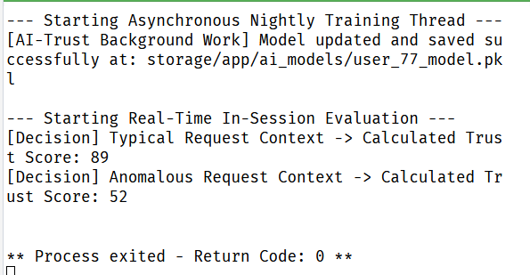

# AI-Trust-HRABAC: Intelligent Two-Layer Zero-Trust Architecture for Banking Systems

An advanced, production-ready implementation of the **AI-Trust-HRABAC** framework. This system upgrades traditional Hybrid Role-and-Attribute-Based Access Control (HRABAC) by decoupling heavy, non-deterministic Machine Learning calculations from the blockchain layer to maintain strict deterministic O(1) efficiency on-chain.

## 🚀 Key Features

- **Progressive Role-to-Behavioral Profiling**: Resolves the AI cold-start problem by utilizing static role-based configurations on Day 1, transitioning automatically to subject-specific behavioral profiling once baseline metrics are established.
- **Asynchronous Decoupled Lifecycle**: Compute-heavy model training runs silently in the background (nightly batch processing), while sub-millisecond evaluations run in real-time via In-Memory RAM caching.

