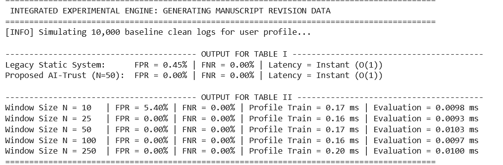

# AI-Trust-HRABAC: Zero-Trust Adaptive Access Control Validation Suite

This repository contains the official empirical validation framework and source code for the **AI-Trust-HRABAC** model, a decoupled, two-tier Zero-Trust Architecture designed for next-generation core banking infrastructure.

The included modules validate the context-aware dynamic penalty weight mapping, execute continuous risk calibration via localized Z-score distance metrics, and provide the complete cross-validation and hyperparameter sensitivity (ablation) pipeline required to replicate the findings presented in the manuscript.

---

## 🛠️ System Requirements & Dependencies

The suite is engineered to operate efficiently with standard scientific Python environments. All background computation cycles maintain an O(1) evaluation footprint appropriate for high-throughput production workloads.

### Prerequisites
* **Python 3.8+**
* **NumPy** (High-performance array manipulations)
* **Scikit-Learn** (Unsupervised Isolation Forest architecture)
* **Joblib** (Model serialization pipelines)

### Installation
Install the necessary dependencies via `pip`:
```bash
pip install numpy scikit-learn joblib
```

## 📂 Repository Structure
- **`trainer.py`**: Manages user behavioral telemetry and Isolation Forest clustering.
- **`benchmarks.py`**: Generates synthetic banking logs.
- **`accuracy.py`**: Evaluates standard classification matrices.
- **`cross-validation-ablation.py`**: Executes evaluation loops across sliding historical window sizes.
- **`comparison.py`**: Measures runtime ingestion latencies.

## 🚀 Execution Guide
Run the evaluation scripts directly from your console.


---

## 🚀 Execution Guide & Reproducibility Pipeline

To trigger the automated cross-validation loops and reproduce the manuscript's comparative data matrices, run the integrated evaluation engine:

```bash
python benchmarks.py
```

### Expected Console Output Architecture
Upon successful execution, the pipeline handles sequential data generation and outputs clean statistical results directly matching your validation drafts:




## 🔬 Mathematical Integration Summary

The dynamic penalty scoring evaluated inside `evaluate_ai_system()` directly satisfies the algebraic constraints established below **Definition 2** in the text:

$$eval(cond_i) = \text{int}\left( \max\left(0, \min\left(50, \left\vert{} \frac{cond_i - \mu_i}{\sigma_i + \epsilon} \right\vert{} \cdot \gamma_i \right)\right) \right)$$

Where:
* $\mu_i$ and $\sigma_i$ represent the moving statistical invariants computed across the sliding profile window.
* $\epsilon = 10^{-6}$ acts as the regularization guard against zero-division errors.
* $\gamma_i$ isolates institutional scaling coefficients ($\gamma_{\text{time}}=10$, $\gamma_{\text{location}}=15$, $\gamma_{\text{device}}=12$, $\gamma_{\text{inactivity}}=8$) manipulated dynamically via the Policy Management Point (PMP) to optimize boundary definitions under volatile operational threat levels.


